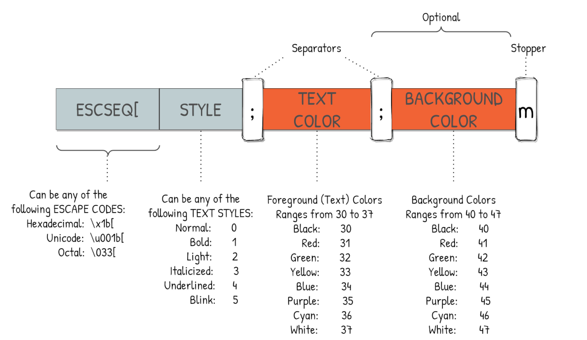

# Заняття 2

### Обчислення та змінні 

---

#### Арифметичні оператори

`+` додавання _6 + 3 = 9_

`-` віднімання _7 - 5 = 2_

`*` множення _6 * 2 = 12_

`/` ділення _10 / 2 = 5_

`//` цілочисельне ділення _11 // 3 = 3_

`%` залишок від ділення _11 % 3 = 2_

`**` піднесення до степеня _4 ** 2 = 16_

#### Оператори присвоювання 

`=` Присвоювання _a = 4_

`+=` Додавання з присвоюванням _a += 2 → a = a + 2_

`-=` Віднімання з присвоюванням _a −= 4 → a = a − 4_

`*=` Множення з присвоюванням _a *= 5 → a = a * 5_

`/=` Ділення із присвоюванням _a /= 6 → a = a / 6_

`%=` Залишок від ділення з присвоюванням _a %= 7 → a = a % 7_

`**=` Піднесення до степеня з присвоюванням	_a **= 8 → a = a ** 8_

#### Змінні 

Змінна — це об’єкт (область) для зберігання даних. 
Python не має команди для оголошення змінної. 
Змінна створюється в той момент, коли ви вперше присвоюєте їй значення. 
Оператор присвоювання = використовується для присвоювання значень змінним.

    x = 23

Оператор присвоювання __=__ використовується для 
присвоювання значень змінним.

    site_name = 'acode.com.ua'
    print(site_name)

#### Типи даних

Тип даних визначає, що може зберігатися всередині змінної.

    number = 12
    string = '-string-'
    fracrion = 45.33

Деякі типи даних: 

> Числа: __int, float,__ Містить числові значення.

Числовий тип даних використовується для зберігання числових значень. 
Цілі числа, числа типу з плаваючою крапкою та складені числа 
потрапляють у категорію чисел у Python і визначаються як int, float.

int — містить цілі числа зі знаком необмеженої довжини.

float — містить числа з плаваючою десятковою крапкою з точністю до 15 знаків після крапки.

> Рядки: __str__ Містить послідовність символів.

Рядок — це послідовність символів, поміщена в одинарні чи подвійні лапки. 

> Логічний: __bool__ Містить True або False.

Логічний тип даних може містити значення лише __True__ або __False__.

#### Введення даних

Для отримання даних від користувача у Python використовується— функція __input()__.
 
    name = input('Введіть імя: ')

    age = int(input('Введіть ваш вік: '))

    nuber = float(input('Введіть дробове чиcло: '))

#### Система імпорту
Код Python в одному _модулі_ отримує доступ до коду в іншому _модулі_.

#### Приклад

В даннму рядку імпортується something_we_want
    
    import something_we_want 

В даннму рядку імпортується something_we_want, як sww 
    
    import something_we_want as sww

В даннму рядку з something_we_want імпортується лише something

    from something_we_want import something

В данному рядку з something_we_want імпортируеться something, як s

    from something_we_want import something as s

Синтаксис as дозволяє звертатися до імпортованого модуля по новому імені 

Наприклад імпорт модуля __OS__. Цей модуль забезпечує портативний спосіб використання залежних від операційної системи функцій.

    import os

_очистка консолі в операційній системі Windows_
<pre>
os.system('cls')
</pre>
_очистка консолі в операційній системі Linux_
<pre>
os.system('clear')
</pre>

--- 

Для додаткових завдань:

- До завдання a.1

    > import sys # Import the sys module to access system-specific parameters and functions
   
- До завдання a.2 
    > import datetime # Import the 'datetime' module to work with date and time
 
 

#### Colors in Raw Python
The 16 colors scheme comprises two sets of 8 colors each (8 backgrounds and 8 foregrounds) and they can be displayed in the terminal by using the following syntax:

